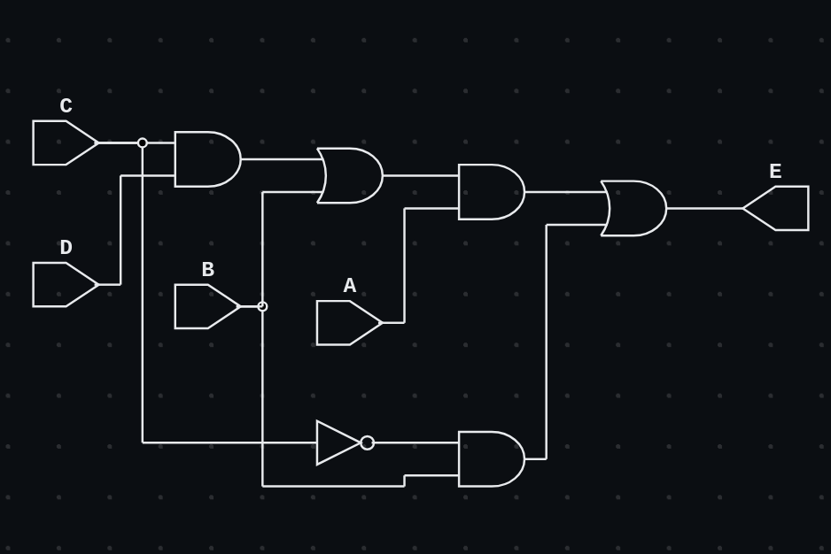

## Boolean function multi level gates in Verilog with ASSIGNMENT

Implements the boolean function using assign statements <br>
```
A(CD + B) + BC'
```
using **AND and OR** gates, which has multiple stages and whose propagation delay accumulates. <br>

### Schematic




