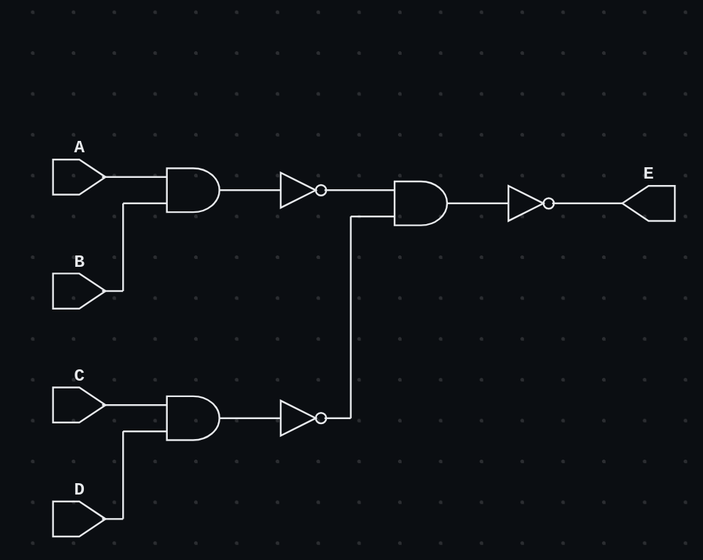

## Sum of Products with NAND in Verilog

Implements the boolean function: <br>
```
AB + CD
```
using universal **NAND** gates. <br>

### Schematic



### Expression Equivalence

```
((AB)' . (CD)')' = ((AB)')' + ((CD)')' = AB + CD
```


